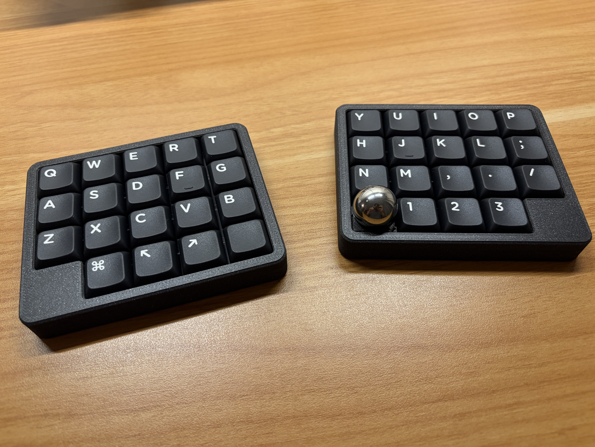
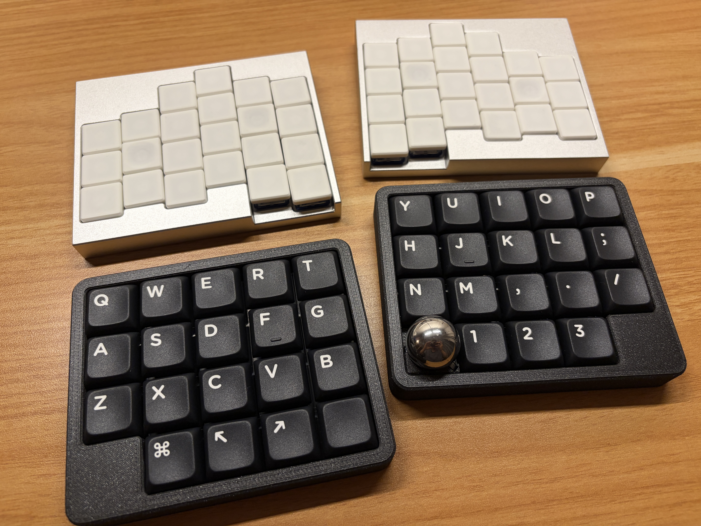

# Ortho-Ball

A low-profile gasket-mounted split keyboard with a trackball.

*Inspired by [poached-eggs]([https://site.omuken.me/poached-eggs/) by Omuken*

## Overview

- **Mounting Style:** Gasket Mount
- **Switches:** Soldered Choc switche
- **Layout:** 37 keys, Ortholinear
- **Connectivity:** Wireless, running the [ZMK Firmware](https://zmk.dev/)
- **Case:** 3D Printed
- **Trackball:** Magnetic 19mm Ball (Using Ball Bearings)
- **Trackball Sensor:** PMW3610

## Gallery

